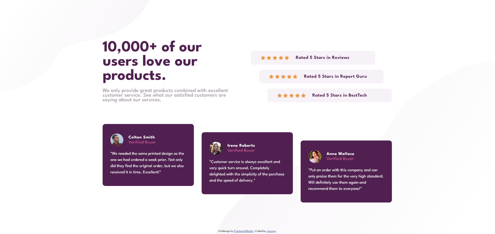

Frontend Mentor - Social Proof Section Solution
This is my solution to the Social proof section challenge on Frontend Mentor. Frontend Mentor challenges help you improve your coding skills by building realistic projects.

Table of contents
Overview

The challenge

Screenshot

Links

Built with

Useful resources

Author

Overview
The challenge
Users should be able to:

View the optimal layout for the section depending on their device's screen size

Screenshot

Links

Live Site URL: [URL](https://bean-123.github.io/Social-proof-section/)

Built with
Semantic HTML5 markup

CSS custom properties

Flexbox

Useful resources
Frontend Mentor - Great platform for real-world projects

React Documentation - Essential for React development

Author

Frontend Mentor - @bean-123
